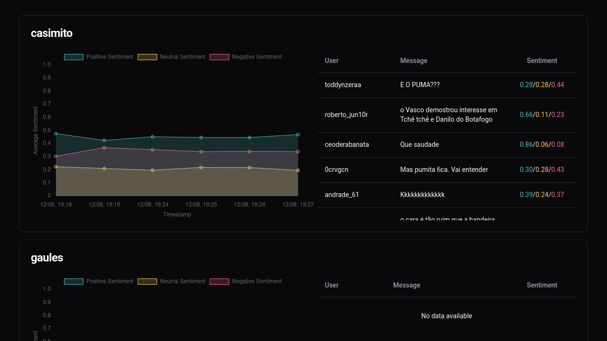
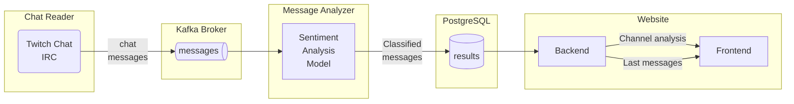
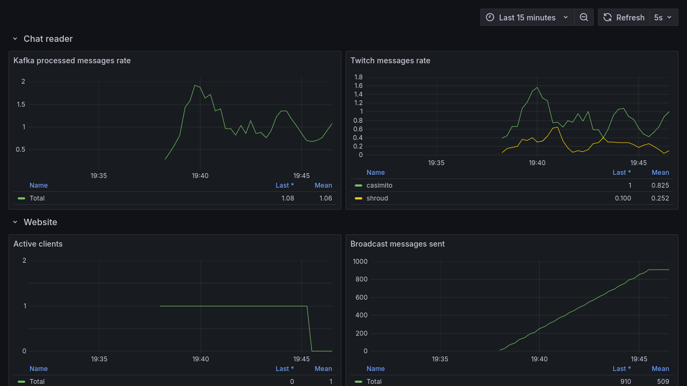

# Twitch Chat Sentiment Analysis

[](https://github.com/FerroEduardo/TwitchSentimentAnalysis/actions/workflows/build.yaml)
[](https://github.com/FerroEduardo/TwitchSentimentAnalysis/actions/workflows/test.yaml)



This repository provides a **Sentiment Analysis System** for Twitch chat messages, leveraging modern technologies for real-time data processing, analysis, and visualization.

## Overview

The project is divided into three services:

1. **Chat Reader**  
   A Go-based service that connects to Twitch IRC, reads chat messages, and produces them to a Kafka topic for further processing.

2. **Message Analyzer**  
    A Python-based service that consumes messages from Kafka, performs sentiment analysis using a Hugging Face neural network model, and stores results in a PostgreSQL database.
   
   - Model Used: [lxyuan/distilbert-base-multilingual-cased-sentiments-student](https://huggingface.co/lxyuan/distilbert-base-multilingual-cased-sentiments-student).

3. **Website**  
   A Go + Vue-based web service that displays the sentiment analysis results and recent messages in real-time via WebSocket updates.

### Key Features

- **Real-Time Data Processing**: Stream and analyze Twitch chat messages instantly.
- **Scalable Architecture**: Decoupled services using Kafka.
- **Insightful Visualization**: Interactive dashboard for visualizing results.
- **Containerized Deployment**: Docker and Docker Compose for streamlined setup.
- **Metrics Integration**: Prometheus and Grafana for monitoring system performance.

---

## System Architecture



---

## Demo

<video src="https://github.com/user-attachments/assets/47a92646-1b8f-4f9e-9c3e-147ebf86df70"></video>

---

## Tech Stack

### Chat Reader
- **Language**: Go
- **Libraries**:
  - [franz-go](https://github.com/twmb/franz-go): Kafka client
  - [go-twitch-irc](https://github.com/gempir/go-twitch-irc): Twitch IRC client
  - [Testcontainers](https://github.com/testcontainers/testcontainers-go): For integration tests

### Message Analyzer
- **Language**: Python
- **Libraries**:
  - [confluent-kafka-python](https://github.com/confluentinc/confluent-kafka-python): Kafka client
  - [transformers](https://huggingface.co/transformers): Neural network API
  - [psycopg2](https://github.com/psycopg/psycopg2): PostgreSQL client

### Website
- **Backend**: Go
  - [gorilla/websocket](https://github.com/gorilla/websocket): WebSocket support
  - [pgx](https://github.com/jackc/pgx): PostgreSQL driver
  - [Testcontainers](https://github.com/testcontainers/testcontainers-go): For integration tests
- **Frontend**: Vue.js
  - [chart.js](https://github.com/chartjs/Chart.js) + [vue-chartjs](https://vue-chartjs.org/): Data visualization
  - [shadcn-vue](https://github.com/unovue/shadcn-vue): UI components
  - [tailwindcss](https://github.com/tailwindlabs/tailwindcss): CSS framework

---

## Metrics and Monitoring

**Prometheus** is used to collect metrics, and **Grafana** visualizes them via a dashboard.

### Available Metrics

#### Chat Reader
- `kafka_messages_processed_total`: Total produced messages
- `twitch_messages_read_total`: Total messages read and filtered by the client

#### Website
- `broadcast_hub_clients_total`: Total active WebSocket clients
- `broadcast_hub_messages_total`: Total messages broadcasted to frontend clients

#### Grafana Dashboard



---

## How to Use

1. **Clone the Repository**

2. **Setup Dependencies**:
   - Install Docker Engine

3. **Run the Project**:
   ```bash
   docker compose up
   ```

4. **Access the Dashboard**:
    - **Website**: [http://localhost:8080](http://localhost:8080)
    - **Grafana**: [http://localhost:3000](http://localhost:3000)
        - Default user and password: `admin`

---

## **Limitations and Bias Disclaimer**  
This project uses the [lxyuan/distilbert-base-multilingual-cased-sentiments-student](https://huggingface.co/lxyuan/distilbert-base-multilingual-cased-sentiments-student) model for sentiment analysis. While the model provides robust multilingual sentiment analysis, it is important to note:

1. **Potential Bias**: The model may reflect biases present in its training data, potentially impacting the accuracy and fairness of sentiment classification.  
2. **Domain Limitations**: The model's performance may vary depending on the language and context of the chat messages.

Users should interpret the results with caution and consider these limitations when analyzing the data.

---

## License

This project is licensed under the [MIT License](LICENSE).
